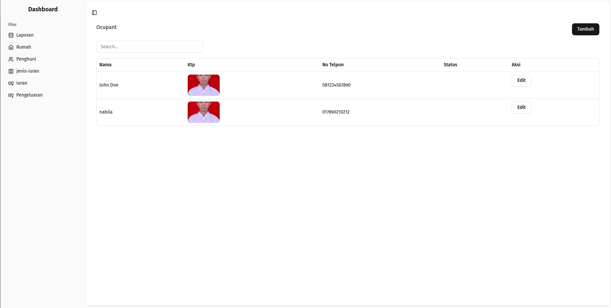

# Keuangan warga (internship test)

Aplikasi manajemen data rumah dan penghuni RT/RW.

## Installation

Ini adalah panduan untuk menginstal dan menjalankan proyek ini di lingkungan lokal Anda.

### Backend (Laravel)

1.  **Clone Repositori:**
    Pertama, *clone* repositori *backend* dari GitHub:
    ```bash
    git clone https://github.com/rsiyun/beon_internship.git
    ```

2.  **Masuk ke Direktori Backend:**
    Navigasi ke direktori *backend* yang baru saja di-*clone*:
    ```bash
    cd backend
    ```

3.  **Instal Dependensi PHP:**
    Instal semua dependensi PHP yang dibutuhkan proyek menggunakan Composer. Pastikan Composer sudah terinstal di sistem Anda.
    ```bash
    composer install
    ```

4.  **Konfigurasi Environment (.env):**
    Buat *file* `.env` dengan menyalin *file* `.env.example`. *File* ini berisi konfigurasi penting seperti koneksi *database* dan kunci aplikasi.
    ```bash
    cp .env.example .env
    ```

5.  **Generate Application Key:**
    Laravel membutuhkan *application key* yang unik untuk keamanan. Jalankan perintah ini untuk menggenerasinya:
    ```bash
    php artisan key:generate
    ```

6.  **Konfigurasi Database:**
    Buka *file* `.env` yang baru dibuat dan atur detail koneksi *database* Anda. Contoh:
    ```env
    DB_CONNECTION=mysql
    DB_HOST=127.0.0.1
    DB_PORT=3306
    DB_DATABASE=nama_database_anda # Ganti dengan nama database yang Anda inginkan
    DB_USERNAME=root             # Ganti dengan username database Anda
    DB_PASSWORD=                   # Ganti dengan password database Anda (kosongkan jika tidak ada)
    ```

7.  **Jalankan Migrasi Database:**
    Setelah mengkonfigurasi *database*, jalankan migrasi untuk membuat tabel-tabel yang dibutuhkan di *database* Anda.
    ```bash
    php artisan migrate
    ```

8.  **Seed Database (Opsional):**
    Jika Anda memiliki *seeder* untuk data awal (misalnya, data admin, data contoh), Anda bisa menjalankannya:
    ```bash
    php artisan db:seed
    ```

9.  **Link Storage (Jika Ada Upload File):**
    Anda perlu membuat *symlink* ke *storage* agar file-file tersebut dapat diakses secara publik.
    ```bash
    php artisan storage:link
    ```

10. **Jalankan Server Lokal:**
    Mulai server pengembangan Laravel. Secara *default*, ini akan berjalan di `http://127.0.0.1:8000`.
    ```bash
    php artisan serve
    ```

---

### Frontend (React JS)

Setelah meng-*clone* repositori utama, Anda juga perlu menyiapkan bagian *frontend*.

1.  **Masuk ke Direktori Frontend:**
    Asumsikan Anda berada di *root* proyek setelah proses *clone*. Navigasi ke direktori *frontend*:
    ```bash
    cd frontend
    ```

2.  **Instal Dependensi Node.js:**
    Instal semua dependensi JavaScript yang dibutuhkan proyek menggunakan npm atau Yarn. Pastikan **Node.js** dan **npm/Yarn** sudah terinstal di sistem Anda.
    ```bash
    npm install
    # atau jika Anda menggunakan Yarn
    yarn install
    ```

3.  **Konfigurasi Environment Frontend:**
    Buat *file* `.env` di direktori *frontend* untuk mengonfigurasi URL *backend* Anda. Ini penting agar *frontend* bisa berkomunikasi dengan API Laravel Anda.
    ```bash
    cp .env.example .env
    ```
    Buka *file* `.env` yang baru dibuat dan tambahkan atau sesuaikan baris berikut:
    ```env
    VITE_API_URL="http://127.0.0.1:8000/api"
    Sesuaikan dengan URL backend Anda
    ```
    *(**Catatan:** Jika Anda menggunakan Vite, *prefix* variabel lingkungan adalah `VITE_`. Jika Anda menggunakan Create React App, *prefix*nya adalah `REACT_APP_`.)*

4.  **Jalankan Aplikasi Frontend:**
    Mulai server pengembangan *frontend*. Ini akan membuka aplikasi React Anda di *browser* pada alamat lokal tertentu (biasanya `http://localhost:3000` atau `http://localhost:5173` untuk Vite).
    ```bash
    npm run dev
    # atau jika Anda menggunakan Yarn
    yarn dev
    ```

Setelah kedua server (backend Laravel dan frontend React JS) berjalan, Anda seharusnya bisa mengakses aplikasi melalui URL *frontend* yang ditampilkan di konsol.

---

# Rangkuman Fitur Aplikasi Manajemen RT/RW

Berikut adalah rangkuman visual dari fitur-fitur utama yang telah diimplementasikan dalam aplikasi ini. Setiap *screenshot* menunjukkan fungsionalitas inti dari fitur tersebut.

---

## 1. Autentikasi Pengguna

### 1.1 Halaman Login
Pengguna dapat masuk ke sistem menggunakan kredensial yang valid.


### 1.2 Dashboard/Laporan
Tampilan dashboard atau halaman laporan yang menampilkan ringkasan data setelah pengguna berhasil login.


---

## 2. Manajemen Rumah

### 2.1 Daftar Rumah
Menampilkan daftar seluruh rumah/kavling yang terdaftar dalam sistem.


### 2.2 Tambah Rumah
Formulir untuk menambahkan data rumah baru ke dalam sistem.


### 2.3 Edit Rumah
Formulir untuk memperbarui informasi detail sebuah rumah yang sudah ada.


### 2.4 Detail Rumah
Tampilan yang menunjukkan informasi lengkap mengenai satu rumah, termasuk daftar penghuni yang tinggal di dalamnya.


---

## 3. Manajemen Penghuni

### 3.1 Menambahkan Penghuni ke Rumah
Proses menambahkan penghuni baru dan mengaitkannya dengan rumah tertentu.


### 3.2 Menghapus Penghuni dari Rumah
Fungsionalitas untuk menghapus atau memindahkan penghuni dari sebuah rumah.


### 3.3 Daftar Penghuni
Menampilkan daftar seluruh penghuni yang terdaftar dalam sistem, terlepas dari rumahnya.


### 3.4 Tambah Penghuni (Global)
Formulir untuk mendaftarkan penghuni baru ke dalam sistem secara umum (mungkin tanpa langsung dikaitkan ke rumah tertentu).


### 3.5 Edit Penghuni
Formulir untuk memperbarui informasi detail seorang penghuni yang sudah ada.


---

## 4. Manajemen Tipe Iuran

### 4.1 Daftar Tipe Iuran
Menampilkan daftar kategori atau jenis-jenis iuran yang ada (misalnya, Kebersihan, Keamanan, Kas).


### 4.2 Tambah Tipe Iuran
Formulir untuk menambahkan jenis iuran baru ke dalam sistem.


### 4.3 Edit Tipe Iuran
Formulir untuk memperbarui detail jenis iuran yang sudah ada.


---

## 5. Manajemen Iuran (Tagihan & Pembayaran)

### 5.1 Daftar Iuran/Tagihan
Menampilkan daftar semua tagihan iuran yang telah dibuat, baik yang sudah dibayar maupun belum.


### 5.2 Tambah Iuran Baru
Formulir untuk membuat tagihan iuran baru untuk penghuni atau periode tertentu.


### 5.3 Edit Iuran
Formulir untuk memperbarui detail tagihan iuran yang sudah ada.


---

## 6. Manajemen Pengeluaran

### 6.1 Daftar Pengeluaran
Menampilkan daftar semua catatan pengeluaran kas RT/RW.


### 6.2 Tambah Pengeluaran
Formulir untuk mencatat pengeluaran baru.


### 6.3 Edit Pengeluaran
Formulir untuk memperbarui detail catatan pengeluaran yang sudah ada.
